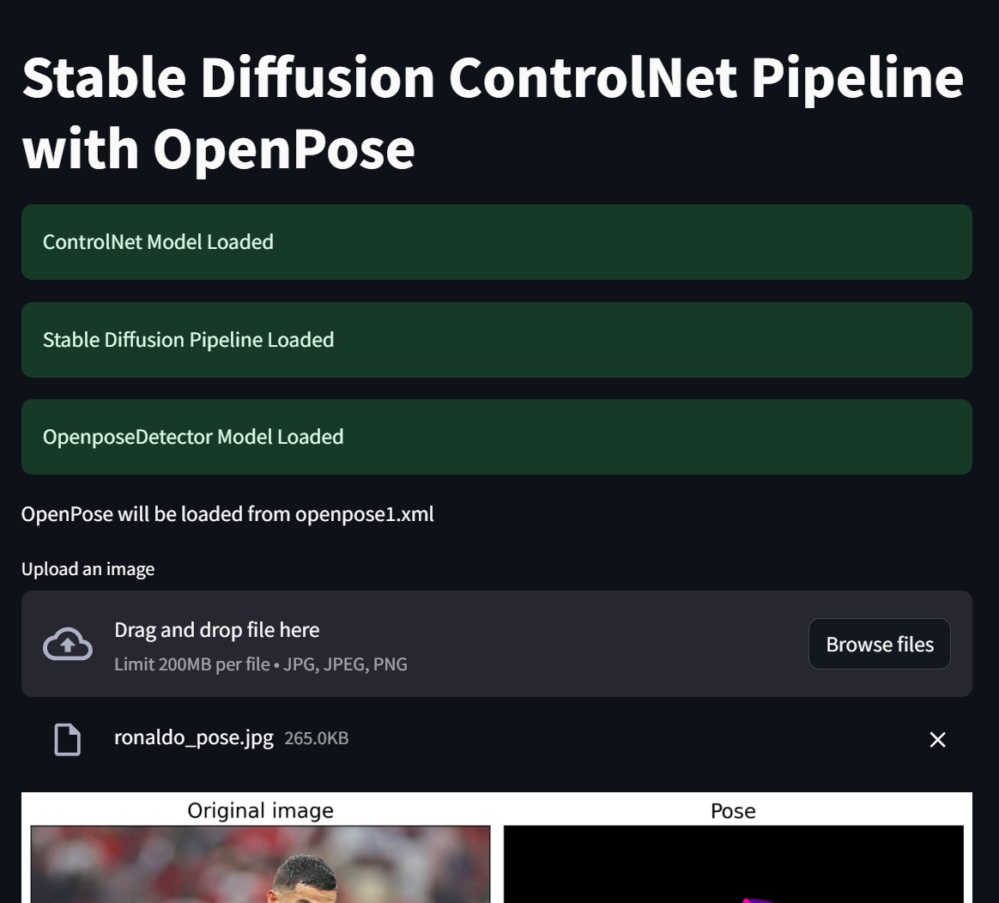
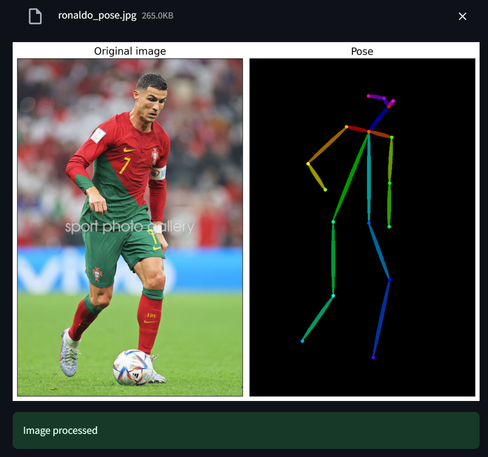

# Stable Diffusion ControlNet Pipeline with OpenPose

This repository contains a Streamlit application that integrates Stable Diffusion, ControlNet, OpenPose, and OpenVINO for real-time human pose estimation. The application allows users to upload images and view enhanced pose annotations, leveraging advanced machine learning models to detect and visualize human poses.

##Features
1.Real-Time Pose Estimation: Utilizes OpenPose for detecting human figures and poses in uploaded images.
2.Enhanced Visualizations: Uses Stable Diffusion and ControlNet to modify or highlight poses, providing a detailed visual representation of human movements.
3.High Performance: Optimized for Intel architectures through OpenVINO, ensuring fast processing times suitable for real-time applications.
4.User-Friendly Interface: Simple web interface built with Streamlit, allowing for easy interaction and accessibility.


## Installation
To set up the project locally, follow these steps:

## Prerequisites
1.Python 3.7 or higher
2.pip

## Clone the Repository
```
git clone https://github.com/siddhant-saini/stable-diffusion-openpose.git
cd stable-diffusion-openpose
```
## Usage
To run the application:
```
streamlit run app.py
```

## Models Used
1.OpenPose: Detects human body, hand, facial, and foot keypoints.
2.ControlNet: Modifies or enhances the detected poses.
3.Stable Diffusion: Used for generating realistic modifications of the original poses.

## Conversion with OpenVINO
The application includes a script for converting the OpenPose model to an optimized format using OpenVINO, which significantly improves inference speed on Intel CPUs and GPUs.





